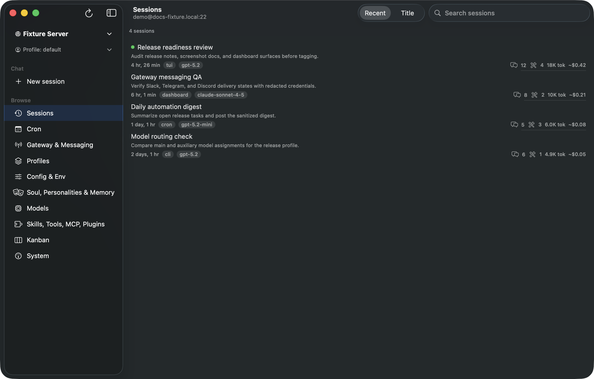
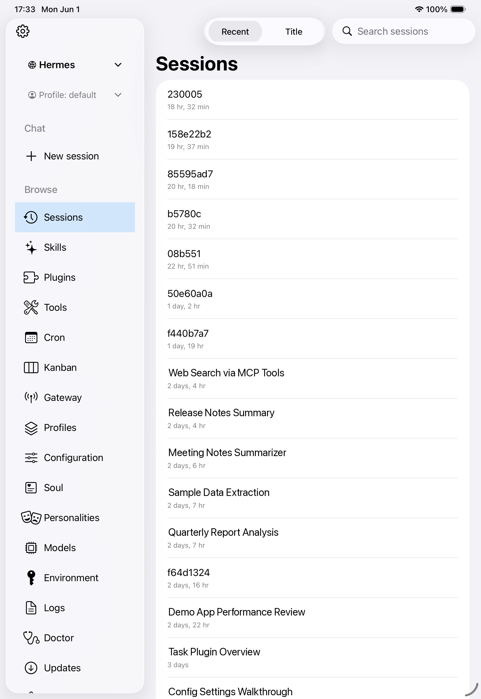
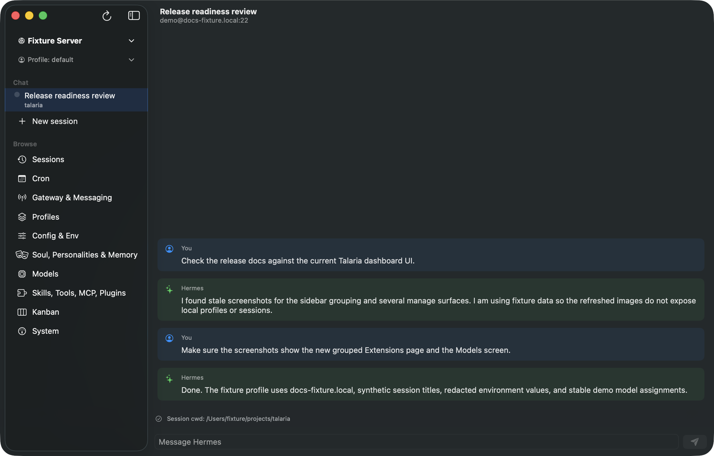
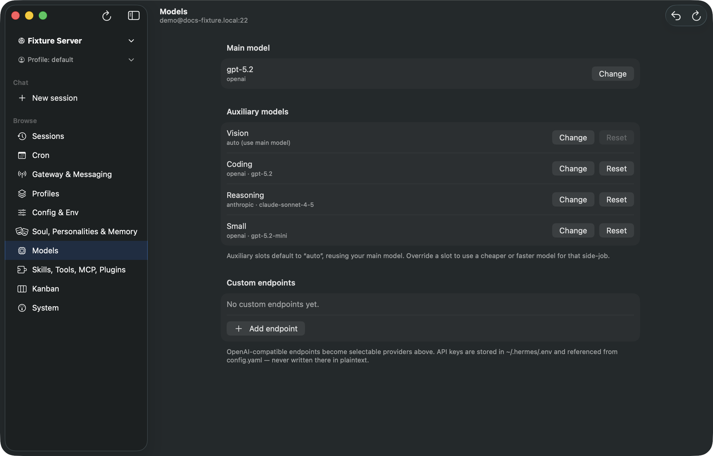
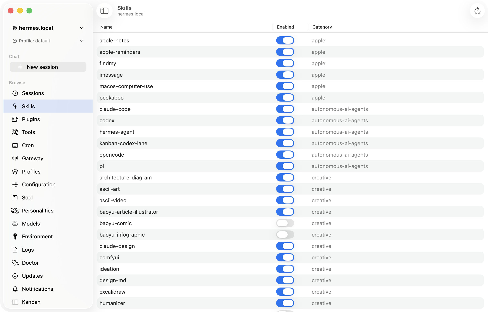
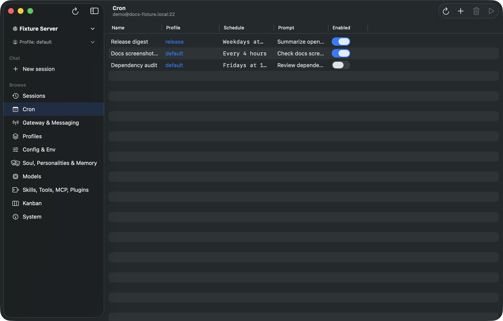

# Talaria

Talaria is a native SwiftUI front-end for Hermes Agent — macOS today, with an in-progress iOS target sharing the same source tree behind platform seam folders. Shared protocol and transport code lives in the `HermesKit` Swift package.

Talaria is one of several GUIs for Hermes Agent. Its distinguishing choice is its **integration boundary**: every surface goes through `hermes dashboard` — non-chat screens over its HTTP API, live chat over its `/api/ws` JSON-RPC gateway — so it never reads or writes Hermes' database or config files directly, and the same path works whether Hermes is local or remote over SSH. It's also fully native, signed, and notarized — not Electron, not a browser tab.

It also manages the full **profile-distribution** lifecycle — install or update a distribution from a git URL, export/import a profile as a `.tar.gz`, author its `distribution.yaml`, and **publish it back to git** — on both macOS and iOS, local or remote. Among Hermes GUIs that's an unusually complete take: the closest, Scarf, does profile export/import but not git install or publish.

See [`docs/comparison.md`](docs/comparison.md) for the full feature-by-feature breakdown against the official Hermes Desktop (and the unrelated third-party app of the same name), the built-in `hermes dashboard`, and the other Hermes front-ends.

## Screenshots

<p align="center">
  
  
</p>

<p align="center"><em>macOS (left) and iPadOS (right) — the Sessions browser, connected to a remote Hermes server over SSH. The iPad build reaches Hermes over the pure-Swift NIO-SSH tunnel.</em></p>

More macOS surfaces — live chat, model assignment, skills, and scheduled jobs:

<p align="center">
  
  
</p>
<p align="center">
  
  
</p>

<p align="center"><em>Chat, Models, Skills, and Cron.</em></p>

## Install

Download the latest signed DMG from the [Releases page](https://github.com/thirteen37/talaria/releases), drag `Talaria.app` to `/Applications`, and launch it from Finder. Updates land via in-app **Talaria → Check for Updates…** (Sparkle).

Or install with Homebrew (no tap required):

```sh
brew install --cask https://raw.githubusercontent.com/thirteen37/talaria/main/Casks/talaria.rb
```

Talaria drives [Hermes Agent](https://github.com/NousResearch/hermes-agent). Install `hermes` separately, include the dashboard web extra (`pip install -U 'hermes-agent[web]'`), and point Talaria at it via the local profile.

## Current Status

This repository contains the dashboard-mode build:

- `Talaria`: SwiftUI app (macOS, with a shared iOS target) — gateway chat (`/api/ws`) plus dashboard-backed Browse surfaces: Sessions, **Skills, Tools, MCP, Plugins** (one tabbed destination — MCP servers include add/edit, enable, connection test, and a Nous-approved install catalog), Cron, Kanban, Gateway, Hermes profiles (clone/rename/delete plus **profile distributions** — install/update from git, view manifest, export/import a `.tar.gz`, author `distribution.yaml`, and publish to git), **Configuration** (the `config.yaml` editor and the `.env` Environment editor as two tabs), **Soul, Personalities & Memory** (the `SOUL.md`/personalities editor, the built-in `MEMORY.md`/`USER.md` editor, and — when Hindsight is the active memory provider — a read-only **Hindsight** browser that lists and semantically searches its vector store, talking to Hindsight's REST API directly), Models, and **System** (Doctor, Updates, and Logs as three tabs). Chats can also be opened as the real Hermes TUI in an embedded terminal (macOS). The Browse sidebar is reorderable and pages can be hidden; a Settings screen holds Server Profiles, Sidebar Order, and Notifications. Optional OS-level chat notifications (agent-finished / tool-approval) and Sparkle auto-update.
- `HermesKit`: Swift package for the JSON-RPC chat-event model, the gateway WebSocket + NIO-SSH transport, dashboard HTTP client/supervisor, CLI fallbacks, profile models, and capability gates.
- `docs`: architecture, security, release, integration coverage, dashboard API, [profile distributions & the `distribution.yaml` schema](docs/profile-distributions.md), and competitor comparison.

## Prerequisite: Hermes Agent

Talaria is only a front-end; it requires a running [Hermes Agent](https://github.com/NousResearch/hermes-agent) to drive (see [Install](#install) for the `hermes-agent[web]` setup).

- Repository: https://github.com/NousResearch/hermes-agent
- Website/docs: https://hermes-agent.nousresearch.com/

Hermes is the source of truth for everything Talaria renders — when behavior is ambiguous, check Hermes:

- ACP behavior and live session protocol details.
- Dashboard HTTP behavior for sessions, logs, skills, cron jobs, and updates.
- CLI command surfaces that do not have dashboard routes yet: `hermes sessions rename`, `hermes tools enable/disable`, `hermes doctor`, the Skills Hub mutations `hermes skills install/update/uninstall` (Skills Hub *search* reads the public Nous index over HTTP instead), and the profile-distribution commands `hermes profile install/update/info/export/import` (with `distribution.yaml` authored directly and git publish run on the host).
- Version and capability gates for features that land after the MVP baseline.

## Development

Run the package tests:

```sh
swift test --package-path HermesKit
```

Build the macOS app without code signing:

```sh
xcodebuild build \
  -project Talaria.xcodeproj \
  -scheme Talaria \
  -destination 'platform=macOS' \
  CODE_SIGNING_ALLOWED=NO
```

Build the shared package for iOS Simulator:

```sh
xcodebuild build \
  -scheme HermesKit \
  -destination 'generic/platform=iOS Simulator' \
  -workspace Talaria.xcworkspace
```

## License

Talaria is released under the [MIT License](LICENSE).

Third-party notices: [ACKNOWLEDGEMENTS.md](ACKNOWLEDGEMENTS.md).
